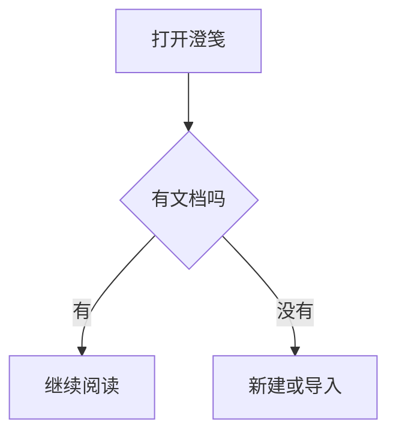

# 澄笺 ChengJian · Markdown 语法教程

> 一份"照着敲就能看见效果"的手册。每一节都按同一个结构写：
> **怎么写** → **长什么样** → **没效果？**（把踩过的坑逐条列出来）

写不动时不用翻文档：编辑页顶栏点「语法」，那里有一份**可点的速查表**——点任意一行，
写法直接插进光标位置，旁边就是它真实渲染出来的效果。

---

## 开始之前

| 你想做的事 | 怎么做 |
| --- | --- |
| 读这份教程 | 书架上的内置卡片，点开即读 |
| 写一篇新文档 | 书架顶栏的加号，或内容区的新建卡 |
| 导入 .md 文件 | 书架顶栏的文件夹按钮，或长按新建卡 |
| 修改一篇文档 | 卡片右上角「⋯」菜单 → 编辑（只读文档先切成「可写」） |
| 归组 / 建文件夹 | 长按封面拖到另一张上合并，或拖进已有文件夹格 |
| 做标注 | 阅读时长按文字，弹出胶囊后选择 |
| 边写边看效果 | 编辑页顶栏的「预览」；分屏模式下左右同步滚动 |
| 查某个写法 | 编辑页顶栏「语法」→ 点一行即插入 |

内置文档默认**只读**（防误改）：在阅读页「更多」面板或书架格子的「选择操作」里切到
「可写」即可编辑；它也能像自建文档一样长按拖动、收进文件夹或合并。

---

## 一、标题与段落

**怎么写**

```markdown
# 一级标题
## 二级标题
### 三级标题
#### 四级标题
##### 五级标题
###### 六级标题
```

**效果**

# 一级标题
## 二级标题
### 三级标题
#### 四级标题
##### 五级标题
###### 六级标题

正文就是普通段落，段落之间**空一行**。想在段落内强制换行，在行尾补**两个空格**。

**没效果？**

- **`#` 后面少了空格**：`#标题` 不识别，必须 `# 标题`；`##`、`###` 同理。
- **超过六个 `#`**：`####### 七级` 不再算标题，会原样显示。
- **`#` 不在行首**：`这行后面 # 号` 里的 `#` 只是普通字符。
- **想显示字面的 `#`**：前面加反斜杠，写成 `\# 这不是标题`。
- 阅读页左侧目录只收录**一到四级**标题；五、六级照样渲染，只是不进目录。

---

## 二、强调：粗体 / 斜体 / 粗斜体

**怎么写**

```markdown
*斜体*  与  _斜体_
**粗体** 与 __粗体__
***粗斜体***
```

**效果**

*斜体* 与 _斜体_、**粗体** 与 __粗体__、***粗斜体***

**没效果？**

- **符号内侧带了空格**：`** 粗体 **` 不生效 —— 强调符号必须**紧贴文字**。
- **符号数量不对称**：`**粗体*` 开了两个只关一个，整行都不会加粗。
- **跨了空行**：`**` 不能越过空行配对，中间有空行就失效。
- **在表格单元格里**：同样要 `| **粗体** |` 这样紧贴文字。

---

## 三、删除线与高亮

**怎么写**

```markdown
~~这段删掉了~~
==这段要标黄==
```

**效果**

~~这段删掉了~~、==这段要标黄==

**没效果？**

- **只写了一个波浪线/等号**：必须成对，`~删除~`、`=高亮=` 都不生效。
- **用了中文标点**：中文的～或＝不是 ASCII 符号，不识别。
- 这两条属于**扩展语法**（标准 Markdown 没有），换到别的编辑器里可能不认；在澄笺里正常。

---

## 四、行内代码

**怎么写**

```markdown
用 `print()` 输出，用 `Ctrl + S` 保存
```

**效果**

用 `print()` 输出，用 `Ctrl + S` 保存

**没效果？**

- **反引号不成对**：漏了收尾反引号，整行后面都会变成代码样式。
- **要在代码里再写反引号**：用两层包裹，写成 `` `反引号是 \`` ``。
- 行内代码**不能换行**；内容长、需要换行时用下面的代码块。

---

## 五、代码块

**怎么写**

````markdown
```text
这是一个普通代码块
保留    空格与换行
```
````

**效果**

```text
这是一个普通代码块
保留    空格与换行
```

**没效果？**

- **首尾围栏数量不一致**：开头三个反引号、结尾也要三个；结尾少了会一直吃到文末。
- **语言名后没换行**：` ```text ` 与内容必须**分行**写。
- **要在代码块里显示三个反引号**：外层用四个反引号包起来。
- **语言名大小写**：`text` / `js` / `java` 按写法高亮，写得随意只是不高亮，不影响显示。
- ⚠️ **六个语言名是"图表开关"**：`mermaid`、`echarts`、`markmap`、`graphviz`、`flowchart`、`abc`
  写成它们**不显示代码**，而是去渲染成图（见第十二节）。想让它们原样显示，把语言名改成 `text`。

---

## 六、引用与提示块

**怎么写**

```markdown
> 一级引用
>> 嵌套一层引用

> [!NOTE]
> 提示块的正文写在这里
```

**效果**

> 一级引用
>> 嵌套一层引用

> [!NOTE]
> 提示块的正文写在这里

**没效果？**

- **`>` 后面少了空格**：`>引用` 不生效，写 `> 引用`。
- **类型名要全大写**：`[!note]` 不认，只认 `NOTE` / `TIP` / `IMPORTANT` / `WARNING` / `CAUTION`。
- **`[!类型]` 后要换行**：`> [!NOTE] 正文` 不渲染提示块，必须换行再写内容。
- 五种类型依次是蓝、绿、紫、黄、红：

> [!NOTE]
> NOTE：补充说明，"顺便一提"的信息。

> [!TIP]
> TIP：小技巧，更省事的做法。

> [!IMPORTANT]
> IMPORTANT：重要信息，漏掉会出问题。

> [!WARNING]
> WARNING：警告，提醒可能的坑。

> [!CAUTION]
> CAUTION：危险操作，可能丢数据。

---

## 七、列表

**怎么写**

```markdown
- 第一项
- 第二项
  - 缩进两个空格 = 嵌套
  - 嵌套第二项

1. 第一步
2. 第二步
```

**效果**

- 第一项
- 第二项
  - 缩进两个空格 = 嵌套
  - 嵌套第二项

1. 第一步
2. 第二步

**没效果？**

- **`-` 后面少了空格**：`-项目` 不生效，写 `- 项目`。
- **嵌套缩进不足**：至少缩进**两个空格**（四个更保险）；顶格写就是同级。
- **列表前后缺空行**：紧贴上一段文字时容易被并进上一段，前后各留一个空行最稳。
- **切换类型要另起一段**：`- 无序` 紧跟 `1. 有序` 若中间没有空行，可能继续按无序渲染。

---

## 八、任务列表

**怎么写**

```markdown
- [ ] 待办事项
- [x] 已完成事项
```

**效果**

- [ ] 待办事项
- [x] 已完成事项

**没效果？**

- **方括号里必须有空格**：`- [] 空的` 不行，未完成要写 `- [ ]`。
- **勾选用小写 x**：`- [X]` 多数解析器也认，但 `- [x]` 最稳。
- **阅读页点不动**？只读文档的勾选**不会写回文件** —— 先在「更多」里切成「可写」。
- 任务列表**不建议嵌套**，嵌套时勾选框位置会错乱；要层级就用普通列表。

---

## 九、表格

**怎么写**

```markdown
| 左对齐 | 居中 | 右对齐 |
| --- | :---: | ---: |
| 内容 | 内容 | 内容 |
```

**效果**

| 左对齐 | 居中 | 右对齐 |
| --- | :---: | ---: |
| 内容 | 内容 | 内容 |

**没效果？**

- **漏了分隔行**：第二行必须是 `| --- |`（或 `| :---: |`）。**少了这一行，整块会按普通文字显示** —— 这是"表格不生效"的头号原因。
- **列数对不上**：表头、分隔行、数据行的 `|` 数量要一致，否则列会错位。
- **要在单元格里写竖线**：用反斜杠转义，写成 `\|`。
- **单元格不能换行**：不支持回车，内容长就让列宽自己撑开。
- 列很多时表格会**横向滚动**，这是正常行为，不是渲染失败。

---

## 十、分割线、链接、图片、脚注、转义

### 分割线

**怎么写**：单独一行写 `---`（`***`、`___` 亦可）

**效果**

---

**没效果？**

- **紧跟在文字下面**：上一行有文字、下一行直接 `---`，会被当成**标题下划线**（把上一行变成一级标题）。前面留一个空行即可。
- 至少要三个 `-`，两个不算。

### 链接

**怎么写**

```markdown
[示例链接](https://example.com)
站内锚点：[跳到第一节](#一标题与段落)
文档间跳转：[去示例文档](./chengjian.md)
```

> `example.com` 是国际标准组织**保留给文档示例专用的域名**，不会指向任何真实网站。
> 本教程演示链接语法一律用它 —— **示例里不出现任何真实厂商域名**，避免误指。

**效果**

[示例链接](https://example.com)

**没效果？**

- **方括号与圆括号之间不能有空格**：`[文字] (地址)` 不成立。
- **地址里带空格**：用 `%20` 代替，或用尖括号包住 `<地址 带空格>`。
- **点了没反应？**在澄笺里：网络链接**点击即复制地址**（不跳浏览器，避免打断阅读）；`#标题` 在本文档内跳转；`./其它.md` 切到那篇文档。
- **`#锚点` 无效**：锚点要写成标题原文（去掉 `#`、去掉空格的那部分）；标题改名后锚点也要跟着改。

### 图片

**怎么写**

```markdown

```

**效果**


**没效果？**

- **必须独立成段**：`` 要**单独占一个段落**（前后各留空行）；写在句子中间不会渲染成图。
- **本地图片要"进"应用**：用编辑页工具条的「插图片」导入，文件落到应用图片目录；直接写本机绝对路径（`D:\照片\a.png`）找不到。
- **相对路径三种写法都能命中**：`a.png`、`./a.png`、`images/a.png`。
- **提示"图片加载失败"**：文件存在但内容损坏，重新导入一次。
- **提示"找不到本地图片文件"**：文件被删了或名字对不上（注意扩展名大小写）。
- **基础模式（纯离线）下网络图片不加载** —— 这是刻意行为，不是 bug。

### 脚注

**怎么写**

```markdown
这句话需要一个注脚[^1]。

[^1]: 注脚内容写在文末。
```

**效果**

这句话需要一个注脚[^1]。

**没效果？**

- **只写了引用没写定义**：必须有 `[^1]: 内容` 那一行，否则只是普通文字。
- **定义行要放文末**：夹在正文中间通常不识别。
- **编号随意但要配对**：`[^a]` 配 `[^a]: ...` 即可，不必是数字。

### 转义

**怎么写**：在符号前加一个反斜杠

```markdown
\*这是星号，不是斜体\*
\# 这不是标题
```

**效果**

\*这是星号，不是斜体\*、\# 这不是标题

**没效果？**

- 只有**部分符号**可转义：`` \ ` * _ { } [ ] ( ) # + - . ! | ~ ``。
- **代码块内部无需转义**，反斜杠会原样显示。

---

## 十一、数学公式

**怎么写**

```markdown
行内：$a^2 + b^2 = c^2$

块级要独立成段：
$$
\frac{1}{n}\sum_{i=1}^{n} x_i
$$
```

**效果**

行内：$a^2 + b^2 = c^2$；块级：

$$
\frac{1}{n}\sum_{i=1}^{n} x_i
$$

**没效果？**

- **开头 `$` 后不能紧跟空格**：`$ a+b $` 会当成普通美元符号，写 `$a+b$`。
- **块级 `$$` 要独立成段**：前后各留空行，夹在句子中间会退化成行内。
- **行内公式不换行**：长公式请用块级。
- **支持的子集**：分数、上下标、根号、求和、积分、矩阵、希腊字母等常用写法；`\begin{cases}` 这类复杂环境不保证渲染。
- 正文里当货币符号的 `$`：前后加空格，或转义成 `\$`。

---

## 十二、图表：六个语言名，写对了就出图

代码块语言名写成下面六个之一，澄笺会**渲染成图**（而不是显示代码）：

| 语言名 | 画什么 | 语法从哪来 |
| --- | --- | --- |
| `mermaid` | 流程图、时序图、状态图、类图、甘特图、饼图… | Mermaid 官方语法 |
| `echarts` | 柱状 / 折线 / 饼图等统计图 | **必须是合法 JSON** |
| `markmap` | 思维导图（由大纲生成） | `#` 标题 + `-` 列表 |
| `graphviz` | 关系网络图 | DOT 语法（`digraph { }`） |
| `flowchart` | 流程图（另一套写法） | flowchart.js 语法 |
| `abc` | 简谱 / 五线谱 | ABC 记谱法 |

**怎么写（以流程图为例）**

````markdown

````

**效果**


**没效果？**

- **语言名拼错或大小写不对**：必须是**全小写**的 `mermaid`、`echarts`…；拼错只会当代码块显示。
- **一个围栏只能画一张图**：两张图要拆成两个代码块。
- **流程图方向写在第一行**：`graph TD`（上到下）/ `graph LR`（左到右）。
- **节点文字含括号等符号**：会被当语法，用引号包住，如 `A["说明（带括号）"]`。
- **`echarts` 必须是合法 JSON**：单引号、尾随逗号、注释都会导致空白图。
- **`graphviz` 要写 `digraph`**：整段包在 `digraph 名字 { ... }` 里，箭头两端写节点名。
- **图表需要联网吗**？不需要 —— 渲染库随应用打包，**纯离线可用**。长时间空白通常是内容本身有语法错误。
- **想放大看**：渲染好的图右上角有放大按钮，可缩放、双指捏合、**单指拖动**、还能旋转。

> [!TIP]
> 图表是**后台并行预渲染**的：打开文档时就已经开始画，滚到位置通常已就绪；
> 若一时没出来，会自动回落到实时渲染再试一次。

---

## 十三、写完之后

- **预览**：编辑页顶栏「预览」，或分屏边写边看。
- **导出**：编辑页「导出 / 分享」→ HTML（图表与图片都会内嵌成单文件）或 Markdown。
- **打印**：导出面板里选「打印」，走系统打印，真实分页。
- **查语法**：顶栏「语法」速查表，点一行即把写法插进正文。

有问题先看对应小节的「没效果？」—— 九成情况都在里面。祝写得顺手。
