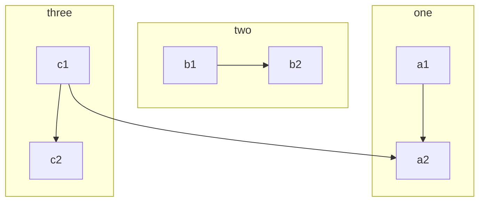
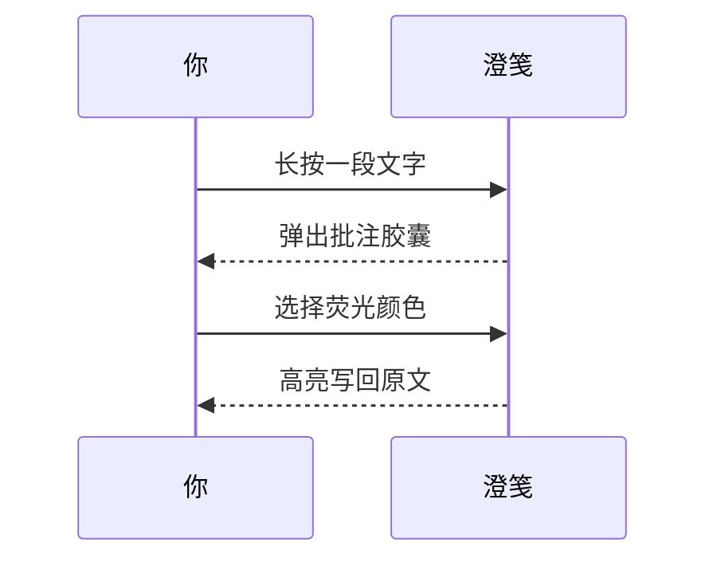
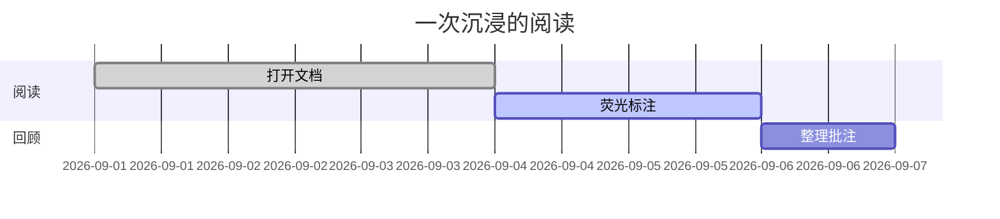
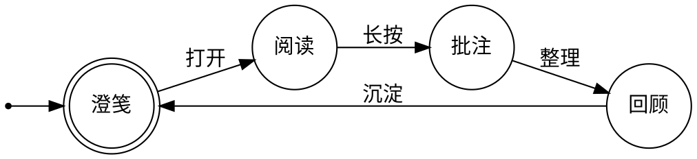

# 澄笺 · 全功能演示

## 寄语

澄笺是一款为 HarmonyOS 打造的**沉浸式 Markdown 阅读器**：澄澈透光的纸面、
卡片式的排版、不打扰的交互。

* 不熟悉 Markdown？长按正文即可批注，所有语法都有示例可抄
* 熟悉 Markdown？直接写，顶部标签多开、分屏实时预览

这是一篇讲解如何正确使用 **Markdown** 的排版示例，学会这个很有必要，
能让你的文章有更清晰的排版。本文同时也是渲染效果的验收样张——
如果你能看到下面每一节的图表与公式都正确显示，说明渲染链路工作正常。

## 语法指导

### 普通内容

这段内容展示了一些常用的排版格式，比如：

- **加粗** - `**加粗**`
- *倾斜* - `*倾斜*`
- ~~删除线~~ - `~~删除线~~`
- `Code 标记` - `` `Code 标记` ``
- [超级链接](https://www.harmonyos.com) - `[超级链接](https://www.harmonyos.com)`

### 表情符号 Emoji

支持大部分标准的表情符号，可使用输入法直接输入。

#### 一些表情例子

😄 😆 😵 😭 😰 😅  😢 😤 😍 😌
👍 👎 💯 👏 🔔 🎁 ❓ 💣 ❤️ ☕️ 🌀 🙇 💋 🙏 💢

### 标题

你可以选择使用 H1 至 H6，使用 #（N 个）打头。

> NOTE: 别忘了 # 后面需要有空格！

#### Heading 4

##### Heading 5

###### Heading 6

### 代码块

#### 普通

```
*emphasize*    **strong**
_emphasize_    __strong__
var a = 1
```

#### 语法高亮支持

如果在 ``` 后面跟随语言名称，可以有语法高亮的效果哦，比如：

##### 演示 ArkTS 代码高亮

```typescript
import { hilog } from '@kit.PerformanceAnalysisKit';

@Entry
@Component
struct Hello {
  build() {
    // 沉浸光感：纸面之上，字如墨落
    Text('Hello, 澄笺')
      .fontColor('#1B1F27')
  }
}
```

##### 演示 Go 代码高亮

```go
package main

import "fmt"

func main() {
	fmt.Println("Hello, 世界")
}
```

> Tip: 语言名称支持下面这些: `typescript`, `js`, `python`, `go`, `html`, `css`, `bash`, `json`, `yml`, `xml` ...

### 有序、无序、任务列表

#### 无序列表

- 阅读
  - 荧光笔
    - 五种颜色
  - 批注
- 编辑
  - 分屏实时预览
  - 工具栏插入
- 文件夹
  - 长按拖动归组
  - 原地展开面板

#### 有序列表

1. 打开澄笺
   1. 书架挑一篇
   2. 或新建一篇
2. 沉浸阅读
   1. 长按做批注
   2. 右滑看目录
3. 导出分享
   1. 导出 HTML
   2. 导出 MD

#### 任务列表

- [X]  沉浸光感渲染
- [X]  荧光笔与批注
- [ ]  更多主题皮肤

### 表格

如果需要展示数据什么的，可以选择使用表格。

| 功能 | 入口 | 说明 |
| -------- | -------- | -------- |
| 批注 | 长按正文 | 荧光笔高亮 + 随笔记事 |
| 目录 | 右滑 | 标题大纲，点击跳转 |
| 亮度 | 底部工具条 | 随心调节，支持常亮 |
| 导出 | 顶栏导出按钮 | HTML / MD / 分享 |

### 隐藏细节

<details>
<summary>这里是摘要部分。</summary>
这里是细节部分。
</details>

### 段落

空行可以将内容进行分段，便于阅读。（这是第一段）

使用空行在 Markdown 排版中相当重要。（这是第二段）

### 数学公式

多行公式块：

$$
\frac{1}{
  \Bigl(\sqrt{\phi \sqrt{5}}-\phi\Bigr) e^{
  \frac25 \pi}} = 1+\frac{e^{-2\pi}} {1+\frac{e^{-4\pi}} {
    1+\frac{e^{-6\pi}}
    {1+\frac{e^{-8\pi}}{1+\cdots}}
  }
}
$$

行内公式：

公式 $a^2 + b^2 = \color{red}c^2$ 是行内。

### 脑图

```markmap
- 澄笺
- 阅读
  - 沉浸光感
  - 荧光笔
    - 五种颜色
    - 波浪线
  - 批注
    - 随笔记事
    - 注释面板
  - 目录大纲
- 编辑
  - 分屏实时预览
  - 一键插入语法
- 导出与分享
  - HTML
  - MD
- 文件夹
  - 长按拖动归组
  - 原地展开面板
- 主题与壁纸
  - 函数绘制壁纸
  - 深浅色跟随
```

### 流程图



### 时序图



### 甘特图



### 图表

```echarts
{
  backgroundColor: "",
  "title": { "text": "最近 30 天阅读时长（分钟）" },
  "tooltip": { "trigger": "axis", "axisPointer": { "lineStyle": { "width": 0 } } },
  "legend": { "data": ["阅读", "批注", "笔记"] },
  "xAxis": [{
      "type": "category",
      "boundaryGap": false,
      "data": ["09-01","09-02","09-03","09-04","09-05","09-06","09-07","09-08","09-09","09-10","09-11","09-12","09-13","09-14","09-15","09-16","09-17","09-18","09-19","09-20","09-21","09-22","09-23","09-24","09-25","09-26","09-27","09-28","09-29","09-30"]
  }],
  "yAxis": [{ "type": "value", "axisTick": { "show": false }, "axisLine": { "show": false }, "splitLine": { "lineStyle": { "color": "rgba(0, 0, 0, .38)", "type": "dashed" } } }],
  "series": [
    {
      "name": "阅读", "type": "line", "smooth": true, "itemStyle": { "color": "#d23f31" }, "areaStyle": { "normal": {} }, "z": 3,
      "data": ["18","14","22","9","7","18","10","12","13","16","6","9","15","15","12","15","8","14","9","10","29","22","14","22","9","10","15","9","9","15"]
    },
    {
      "name": "批注", "type": "line", "smooth": true, "itemStyle": { "color": "#f1e05a" }, "areaStyle": { "normal": {} }, "z": 2,
      "data": ["3","2","4","1","0","3","2","2","3","4","1","2","4","3","2","4","1","3","2","2","6","5","3","5","2","2","4","2","2","4"]
    },
    {
      "name": "笔记", "type": "line", "smooth": true, "itemStyle": { "color": "#4285f4" }, "areaStyle": { "normal": {} }, "z": 1,
      "data": ["2","1","2","0","0","1","1","1","2","2","0","1","2","2","1","2","0","2","1","1","3","2","1","3","1","1","2","1","1","2"]
    }
  ]
}
```

### 五线谱

```abc
X: 24
T: Clouds Thicken
C: Paul Rosen
S: Copyright 2005, Paul Rosen
M: 6/8
L: 1/8
Q: 3/8=116
R: Creepy Jig
K: Em
|:"Em"EEE E2G|"C7"_B2A G2F|"Em"EEE E2G|\
"C7"_B2A "B7"=B3|"Em"EEE E2G|
"C7"_B2A G2F|"Em"GFE "D (Bm7)"F2D|\
1"Em"E3-E3:|2"Em"E3-E2B|:"Em"e2e gfe|
"G"g2ab3|"Em"gfeg2e|"D"fedB2A|"Em"e2e gfe|\
"G"g2ab3|"Em"gfe"D"f2d|"Em"e3-e3:|
```

### Graphviz



### Flowchart

```flowchart
st=>start: 打开澄笺
op=>operation: 沉浸阅读
cond=>condition: 有灵感？
e=>end

st->op->cond
cond(yes)->e
cond(no)->op
```

### 脚注

这里是一个脚注引用[^1]，这里是另一个脚注引用[^bignote]。

[^1]: 第一个脚注定义。

[^bignote]: 脚注定义可使用多段内容。

    缩进对齐的段落包含在这个脚注定义内。

    ```
    可以使用代码块。
    ```

    还有其他行级排版语法，比如**加粗**和[链接](https://www.harmonyos.com)。

这里是一个脚注引用[^1]，这里是另一个脚注引用[^bignote]。

```
[^1]: 第一个脚注定义。
[^bignote]: 脚注定义可使用多段内容。

    缩进对齐的段落包含在这个脚注定义内。
    可以使用代码块。
    **加粗**
    [链接](https://www.harmonyos.com)
```

## 阅读技巧

| 操作 | 方式 |
| --- | --- |
| 荧光笔 / 批注 | 长按正文选中一段 |
| 注释面板 | 左滑 |
| 目录大纲 | 右滑 |
| 字号 / 亮度 | 底部工具条 |
| 导出 / 分享 | 顶栏导出按钮 |
| 多文档 | 顶部标签，长按管理 |

## 结语

愿每一篇值得反复阅读的文字，都有一张安静的纸。

澄笺与您同行~
