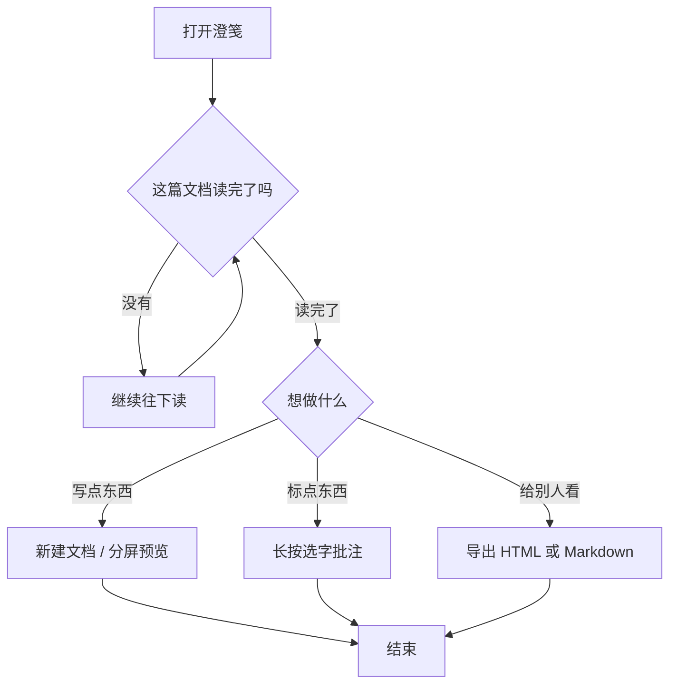
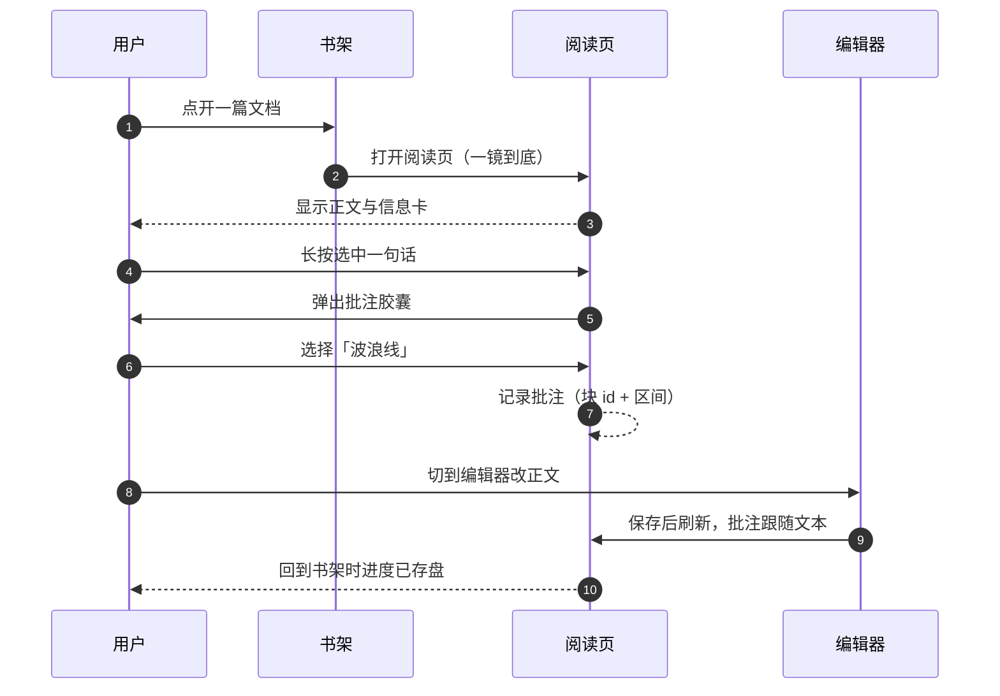
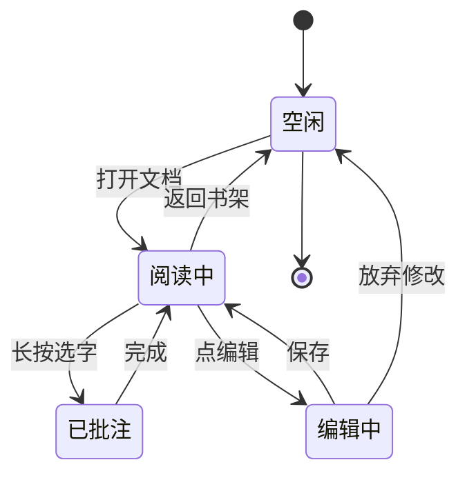
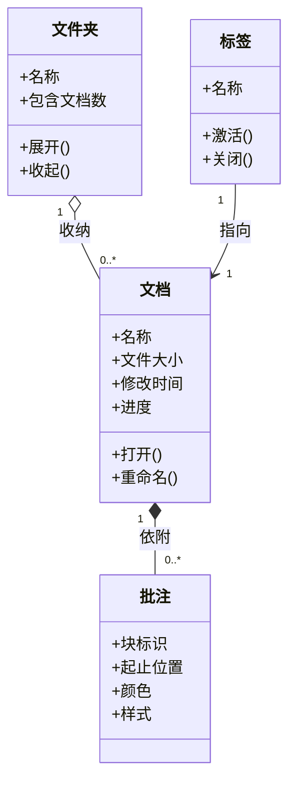
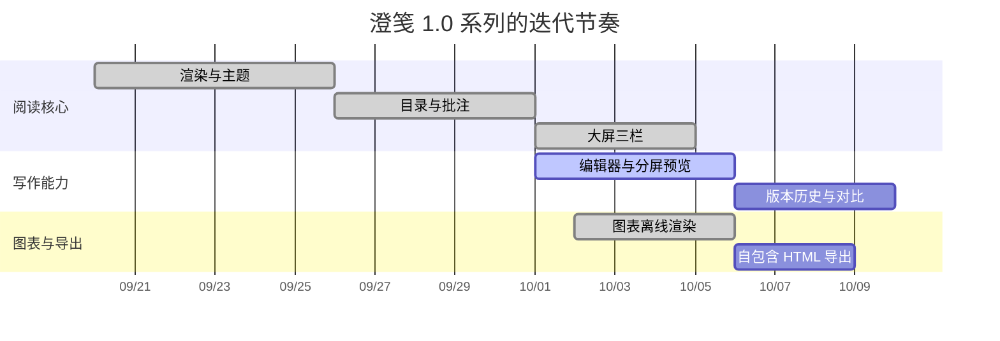
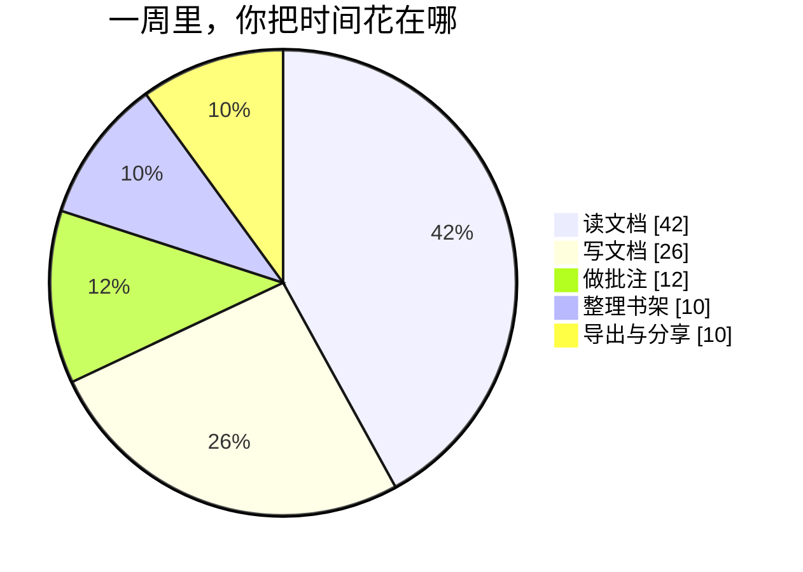
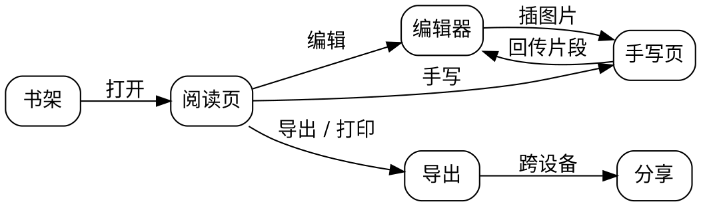

# 澄笺 · 全功能演示


> **澄笺（ChéngJiān）**，一款为 HarmonyOS 打造的沉浸式 Markdown 阅读与写作应用。
> 「澄」是澄澈透光，「笺」是文人纸笺 —— 我们把这两件事放在了一起：
> 玻璃质感的界面，与一张安静好写的纸。

这一篇不只是介绍文档，更是**渲染效果的验收样张**：从头读下去，你会依次看到排版、
批注、公式、九类图表、导出与手写。如果你看到每一节都正确显示，说明这台设备上的
渲染链路工作正常。

> [!TIP]
> 想边读边试？长按任意一段文字试试批注；或者点卡片右上角的「⋯」把这篇文档切成
> 「可写」，直接在上面改。

---

## 一、它是什么

一句话：**本地优先、不打扰、能装下复杂内容的 Markdown 工具。**

| 你关心的事 | 澄笺怎么做的 |
| --- | --- |
| 我的文件在哪 | 全部在本机应用目录里，不联网也能用（可用「基础模式」彻底断网） |
| 阅读体验 | 五档纸色主题、四档字号、可换字体、可调行距与栏宽 |
| 界面观感 | API 26 沉浸光感材质：卡片、按钮、顶栏底栏都是通透的玻璃 |
| 写东西 | 多标签、分屏实时预览、版本历史、查找替换、语法速查 |
| 标东西 | 长按选字做批注（荧光底 / 波浪线）、手写笔记、手写批注 |
| 复杂内容 | 公式、流程图、时序图、思维导图、统计图、乐谱，全部**离线**渲染 |
| 拿出去 | 导出 HTML（自包含单文件）/ Markdown，系统打印，跨设备分享 |

### 开源与致谢

**源码仓库**

- GitHub：[FengHDSL/LiteMdReader-HarmonyOS](https://github.com/FengHDSL/LiteMdReader-HarmonyOS)
- Gitee：[pandasoos/LiteMdReader-HarmonyOS](https://gitee.com/pandasoos/LiteMdReader-HarmonyOS)

**开源许可**：澄笺以 **MIT License** 开源 —— 可以自由地使用、修改、再分发；
唯一的要求是保留版权声明与许可文本，全文见仓库根目录的 `LICENSE` 文件。

**参考的项目**（仅参考思路，未复制其代码）

- [MrCashmere/miha_hm](https://github.com/MrCashmere/miha_hm)：沉浸光感承载层（Toggle + attributeModifier）方案
- [skadjhljhas/zhumo-reader](https://github.com/skadjhljhas/zhumo-reader)：注释卡片式的阅读形态
- [younghz/Markdown](https://github.com/younghz/Markdown)：《Markdown 语法教程》的语法口径与分类参考

**内置的渲染组件**（随应用打包、全部离线可用，各自遵循其原始开源许可，许可全文见各自仓库）：

| 组件 | 用途 |
| --- | --- |
| Mermaid | 流程图 / 时序图 / 状态图 / 类图 / 甘特图 / 饼图 |
| Apache ECharts | 柱状 / 折线等统计图 |
| Markmap | 思维导图 |
| Graphviz（viz.js） | 关系网络图 |
| flowchart.js | 流程图（另一套写法） |
| KaTeX | 数学公式 |
| abcjs | 五线谱（ABC 记谱） |
| Lute | Markdown 解析 |
| d3 / Raphael | 上述库的渲染依赖 |

### 它不太想做的事

- 不想让你注册账号：没有登录页，没有云端账号体系。
- 不想替你决定文件去哪：导入就是复制一份进应用，原文件不动。
- 不想在你读书时打扰你：网络链接**点击只复制地址**，不弹浏览器。

---

## 二、界面一览

### 书架

网格与列表两种形态，长按封面拖动可**合并成文件夹**；封面颜色由文件名哈希生成，
也能自己指定底色或换成图片。集齐的文档可以拖来拖去重新排序。

- [x] 继续阅读横幅（可在「外观设置」里关掉）
- [x] 长按拖动合并 / 收进文件夹
- [x] 全文搜索：文件名、正文、图片三组结果
- [x] 列表模式：树形的文件夹展开

### 阅读页

正文区之外，一切都可以收起来：

- 顶栏 / 底栏滚动时自动收起，上滑或回顶恢复；
- 左侧目录、右侧批注可停靠（大屏专属），列表里的批注可一键跳回原文；
- 标签栏可以放在顶部，也可以沉到底部胶囊里；
- 信息卡展示字数、行数、标题数、代码块数、文件大小、MD5 / SHA-256。

### 编辑器

| 能力 | 说明 |
| --- | --- |
| 多标签 | 同时开好几篇，标签名过长自动截断 |
| 分屏预览 | 左写右看，两侧滚动互相带 |
| 版本历史 | 定时快照 + 手动记录；支持左右**分屏对比**（新增行 / 删除行着色） |
| 查找替换 | 支持正则式的匹配计数、上一处 / 下一处、全部替换 |
| 语法速查 | 十八行语法，点一行插到光标位置，旁边就是真实渲染效果 |
| 手写 | 调起手写画布，写完插入正文或作为批注 |

---

## 三、排版示例：这篇文档本身就是样张

### 强调与标记

**粗体**、*斜体*、***粗斜体***、~~删除线~~、==高亮==、`行内代码`。

### 列表与任务

- 无序列表第一项
- 第二项
  - 缩进两格就是嵌套
  - 嵌套也能有自己的行内标记，比如 **加粗**
- 第三项结束了

1. 有序列表按数字自增
2. 中间插入别的编号不打断顺序
3. 第三项

- [x] 已完成：把这篇文档读完
- [ ] 待办：长按一段文字试试批注
- [ ] 待办：把标签栏切到底部看看

### 引用与提示块

> 单层引用
>> 嵌套一层，用来做"引用里再引用"
>>> 还能再深一层，但三层已经很挤了

> [!NOTE]
> 五类提示块的颜色各不相同：NOTE 蓝、TIP 绿、IMPORTANT 紫、WARNING 黄、CAUTION 红。

> [!IMPORTANT]
> 提示块要在 `> [!类型]` 之后**换行**写内容，同一行写正文不会被识别。

### 表格

| 能力 | 快捷键 / 入口 | 备注 |
| --- | :---: | ---: |
| 全文搜索 | 书架顶栏放大镜 | 正文与文件名都搜 |
| 文档内查找 | 阅读页放大镜 | 高亮全部命中 |
| 跳转行 | 编辑页更多 | 输入行号直达 |
| 版本对比 | 编辑页更多 → 版本历史 | 左右分屏 |

---

## 四、数学公式

行内公式直接写在句子里：质能方程 $E = mc^2$，勾股定理 $a^2 + b^2 = c^2$，
圆面积 $S = \pi r^2$。

块级公式单独成段，适合展示推导：

$$
\frac{d}{dx}\left( \int_{a}^{x} f(t)\,dt \right) = f(x)
$$

$$
\begin{pmatrix} a & b \\ c & d \end{pmatrix}
\begin{pmatrix} x \\ y \end{pmatrix}
= \begin{pmatrix} ax + by \\ cx + dy \end{pmatrix}
$$

$$
\sum_{i=1}^{n} i = \frac{n(n+1)}{2}, \qquad
\lim_{n \to \infty} \left(1 + \frac{1}{n}\right)^n = e
$$

> [!WARNING]
> 开头的 `$` 后面**不能紧跟空格**：`$ a+b $` 会被当成普通美元符号，要写 `$a+b$`。

---

## 五、九类图表：这才是重头戏

下面是澄笺支持的全部图表类型。每一节都给出**能直接复制走的最小示例**，以及
"渲染不出来"时最可能的原因。

> [!TIP]
> 所有图表都**离线渲染** —— 渲染库随应用打包，飞行模式下照常出图。
> 画好的图右上角有放大按钮：可缩放、双指捏合、**单指拖动**、还能旋转。

### 5.1 流程图（mermaid · graph）



要点与坑：

- 第一行的 `graph TD` 决定方向：`TD` 上到下、`LR` 左到右、`RL` 右到左、`BT` 下到上。
- `[]` 是矩形、`()` 是圆角、`{}` 是菱形、`(())` 是圆。
- 节点文字里出现括号、冒号等符号时，用引号包住：`A["说明（带括号）"]`。
- 箭头上的文字写 `-- 文字 -->`。

### 5.2 时序图（mermaid · sequenceDiagram）



要点与坑：

- 参与者用 `participant 别名 as 显示名` 起中文名；不写就用默认的 A、B。
- 实线箭头 `->>`、虚线 `-->>`；`autonumber` 会自动编号。
- 想加备注：`Note over U,R: 说明文字`。

### 5.3 状态图（mermaid · stateDiagram）



要点：`[*]` 是起点 / 终点；`A --> B: 事件` 冒号后是触发条件。

### 5.4 类图（mermaid · classDiagram）



要点：`+` 公开、`-` 私有；`o--` 聚合、`*--` 组合、`-->` 关联。

### 5.5 甘特图（mermaid · gantt）



要点与坑：

- `title` 写标题；`dateFormat` 必须与任务日期格式一致（这里都是 `YYYY-MM-DD`）。
- `done` / `active` 标出已完成与进行中；`after 任务名` 让任务接在前一个之后。
- **日期标签挤在一起**？跨度只有两三周时，刻度默认按天铺，`%m/%d` 就糊成一片。
  澄笺已把甘特图刻度固定为**一周一格**；若你的跨度更短（几天），把
  `axisFormat` 换成 `%d`（只显示日）就能进一步拉开。

### 5.6 饼图（mermaid · pie）



要点与坑：

- 第一行必须是 `pie`，`showData` 让扇区上直接显示数值。
- **标签必须用双引号包住**：`"读文档" : 42`。中文或含空格的标签不加引号会直接报
  `Lexical error`（整张图变成错误提示），这是饼图最常见的失败原因。
- 冒号两侧各留一个空格，数值不要带百分号（写了 `%` 会当成语法）。

### 5.7 统计图（echarts）

```echarts
{
  "title": { "text": "各文档阅读完成度", "left": "center" },
  "tooltip": { "trigger": "axis" },
  "legend": { "bottom": 0, "data": ["已读百分比"] },
  "grid": { "left": 40, "right": 20, "top": 50, "bottom": 40 },
  "xAxis": {
    "type": "category",
    "data": ["语法教程", "功能演示", "读书笔记", "会议记录"]
  },
  "yAxis": { "type": "value", "max": 100, "name": "%" },
  "series": [
    {
      "name": "已读百分比",
      "type": "bar",
      "barWidth": "46%",
      "itemStyle": { "borderRadius": [6, 6, 0, 0] },
      "data": [100, 86, 42, 15]
    }
  ]
}
```

折线 + 面积图同理，把 `"type": "bar"` 换成 `"line"`，并可用 `"areaStyle": {}` 填充。

> [!TIP]
> **坐标轴文字太长、挤成一片怎么办**？在对应轴的配置里加两行即可：
> ```json
> "axisLabel": { "rotate": 30, "interval": 0 }
> ```
> `rotate` 让标签倾斜排布，`interval: 0` 表示每个标签都显示（不自动跳档）。
> 类目名特别长时，再配 `"grid": { "bottom": 80 }` 给下方留出空间。
> 甘特图（mermaid）则用 `axisFormat` 控制日期格式，跨度大就用 `%m/%d`、跨度小用 `%d`。

> [!CAUTION]
> `echarts` 块里的内容**必须是合法 JSON**：不能有单引号、注释、尾随逗号。
> 图空白九成是 JSON 写错了 —— 贴到任意 JSON 校验工具过一遍最快。

### 5.8 思维导图（markmap）

```markmap
# 澄笺
## 阅读
### 五档纸色主题
### 目录 / 批注侧栏
### 标签多开
## 写作
### 分屏实时预览
### 版本历史与对比
### 查找替换
## 表达
### 公式与九类图表
### 手写笔记与手写批注
### 荧光底 / 波浪线批注
## 数据
### 本地优先，不联网可用
### 导出 HTML / Markdown
### 跨设备分享
```

要点：结构就是 **Markdown 大纲** —— `#` 是根节点、`##` 一级分支、`-` 也可以当节点。
**首行写的那个标题会成为根节点**。

### 5.9 关系网络图（graphviz）与乐谱（abc）

`graphviz` 用 DOT 语法画关系网：



`abc` 用 ABC 记谱法画**五线谱**（多声部也可以，下面这首是专为澄笺写的主题小曲）：

> [!NOTE]
> 这首《澄笺 · 主题》为**AI 为本文创作**的原创小曲（C 宫五声音阶，未参考任何现有作品），
> 若觉得好听可以随便用 —— MIT 同款待遇。

**钢琴谱（ABC 记谱 · 高低音双谱表）**

```abc
X:1
T:澄笺 · 主题（AI 创作）
C:Melody written by AI for ChengJian
M:4/4
L:1/8
Q:1/4=72
K:C
%%score { RH LH }
V:RH clef=treble name="Piano"
V:LH clef=bass name="Piano"
V:RH
C2 D2 E2 G2 | A2 G2 E2 D2 | E2 G2 A2 c2 | A4 z4 |
c2 A2 G2 E2 | G2 E2 D2 C2 | D2 E2 G2 A2 | G4 z4 |
V:LH
[C,E,G]4 [C,E,G]4 | [A,,C,E]4 [G,,C,D]4 | [C,E,G]4 [C,E,A]4 | [A,,C,E]4 [A,,C,E]4 |
[C,E,G]4 [C,E,A]4 | [C,E,G]4 [G,,C,D]4 | [A,,C,D]4 [C,E,G]4 | [C,E,G]4 [C,E,G]4 |
```

> [!TIP]
> ABC 里 `,` 表示低八度（`C,` = 低音 do）、`'` 表示高八度；`[C,E,G]` 是同时按下的和弦；
> 音符后的数字拉长时值（`G4` 是两个二分音符的长度，按 `L:1/8` 计）。

**没效果？**

- **语言名必须是 `abc`**（全小写）；拼错只会当代码块显示。
- **`X:1` 与 `K:C` 两行不能少**：没有调号行（`K:`）abcjs 不渲染。
- **多声部**：`V:名字` 声部 + `%%score { RH LH }` 声部编排，缺 `%score` 行会按顺序叠谱。
- **播放按钮没出现**：说明设备不支持 Web Audio（极少见），或 ABC 语法在解析时报错 ——
  先把内容简化到四小节试播，逐步加回来定位问题。

> [!NOTE]
> 还有第六个语言名 `flowchart`（flowchart.js 的老写法），澄笺也支持：
> 它以 `st=>start:` 开头、`e=>end:` 结尾，用 `->` 连接节点。
> 三种流程图写法（mermaid / flowchart / graphviz）任选一种顺手的即可。

### 图表速查

| 语言名 | 首行怎么写 | 最容易踩的坑 |
| --- | --- | --- |
| `mermaid` | `graph TD` / `sequenceDiagram` / `stateDiagram-v2` / `classDiagram` / `gantt` / `pie` | 语言名必须全小写；一张图一个代码块 |
| `echarts` | 直接写 JSON 的 `{` | 必须是合法 JSON |
| `markmap` | `# 根节点` | 根节点就是第一行标题 |
| `graphviz` | `digraph 名字 {` | 别忘了最外层大括号 |
| `flowchart` | `st=>start: 开始` | 末尾要有 `e=>end:` |
| `abc` | `X:1` | `K:` 调号行不能少 |

---

## 六、批注与手写

### 批注

阅读时长按选中文字，会弹出一枚可拖动的胶囊：

- **荧光底**：整段变成浅色底纹，适合划重点；
- **波浪线**：文字下方一条波浪，适合标"这里要再看一遍"；
- 颜色四选：红 / 绿 / 蓝 / 黄；
- 右侧批注抽屉按文档汇总，点一条可跳回原文位置。

批注是**跟着文本走**的：坐标系记的是「块 id + 渲染文本区间」，
所以你在编辑器里改了别处、批注仍会贴在原来那句话上。

### 手写

从编辑页或阅读页进入手写画布（华为手写笔套件 Pen Kit）：

- 画布背景可换：12 款淡色底 + 「主题色」动态跟随 + 五款壁纸同色底；
- 底纹四选：无 / 小方格 / 单行线 / 点阵，线条粗细三档；
- 写完点「插入」——手写图会带着**你选的底色与底纹**一起插进正文；
- 批注模式下写完，会落成一条带手写图的双下划线批注。

> [!IMPORTANT]
> 手写图的底色与底纹是**烘焙进图片**的，所以插入正文后在任何主题下都不会糊掉。

---

## 七、数据在自己手里

| 动作 | 入口 | 说明 |
| --- | --- | --- |
| 导出单篇 | 卡片「⋯」→ 导出 / 分享 | HTML（自包含）或 Markdown |
| 打印 | 导出面板 → 打印 | 走系统打印，真实分页 |
| 整库备份 | 设置 → 数据管理 | 打包成 zip，含图片与设置 |
| 图片管理 | 设置 → 数据管理 → 图片管理 | 集中查看、导出、移除 |
| 跨设备分享 | 阅读页碰一碰 / 隔空传送 | HarmonyOS 设备间直传 |

> [!NOTE]
> 全量模式下可开启网络备份与检查更新；**基础模式**彻底不联网，
> 网络图片不加载、网络功能不可用，本地功能一切照常。

---

## 八、这篇文档怎么用

1. 把它当**样张**：从头翻一遍，确认图表、公式、表格都正常显示。
2. 把它当**模板**：切到「可写」，删掉不需要的章节，留下你要的结构。
3. 把它当**速查**：上面的图表速查表可以直接复制到你的新文档里改。
4. 更细的语法规则（含"没效果"的排查）见另一篇内置文档《Markdown 语法教程》。

想深入哪一种图表，就去「更多 → 语法」面板里找那一行 —— 点一下，示例会直接插进你的正文。

---

*澄笺 · 安静地读，顺手地写。*

---

*本文档（含其中展示的示例乐谱小曲）由 AI 辅助生成，并经人工校对；示例内容仅供参考，
准确性由使用者自行判断。*
